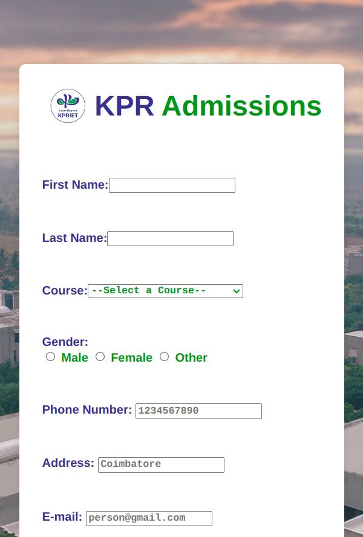
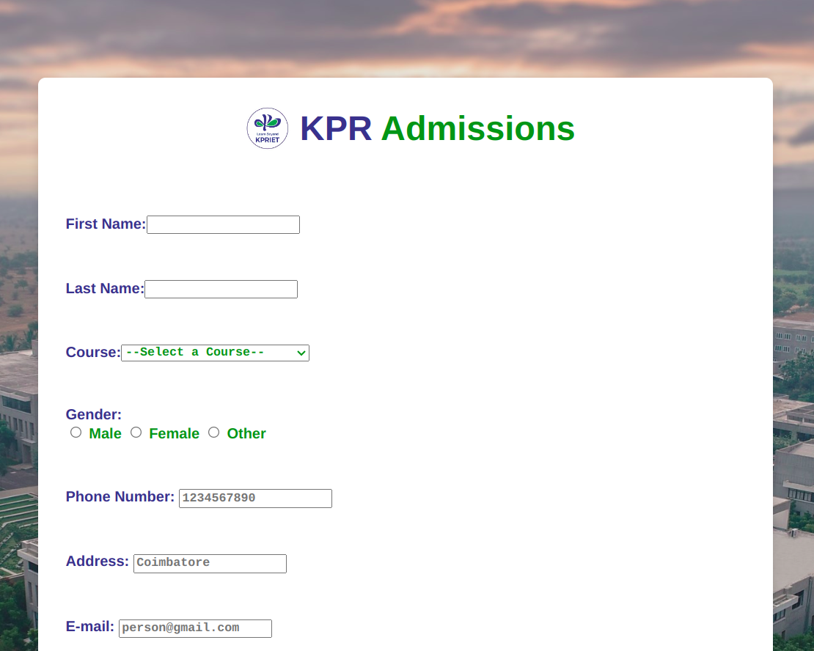

---

# Password Confirmation and Email Validation Form

This project demonstrates how to create a simple registration form with JavaScript validation. The form includes password confirmation and email validation to ensure users meet specific criteria before submitting the form.

# check the site
visit: https://admission-form-kpriet.netlify.app/

## Website Images
|  |  |  | 
|:-------------------:|:-------------------:|:-------------------:|
|      full       |        Mobile        |      Close       |


## Features

- **Password Confirmation**: Ensures that the password and confirm password fields match.
- **Email Validation**: Checks if the email entered ends with `@gmail.com`.
- **Responsive Design**: Ensures the form is styled and centered for a better user experience.

## Files

- `index.html`: Contains the HTML structure of the form.
- `styles.css`: Contains the CSS styling for the form (if used).
- `script.js`: Contains the JavaScript validation logic.

## Setup

1. **Clone the Repository**:

    ```bash
    git clone https://github.com/majipa007/Admission_Form.git
    cd Admission_Form
    ```

2. **Open `index.html`**:
    - Open `index.html` in a web browser to view and interact with the form.

## Usage

1. **Password Confirmation**:
   - Enter a password in the "Password" field.
   - Enter the same password in the "Confirm Password" field.
   - The form will alert and prevent submission if the passwords do not match.

2. **Email Validation**:
   - Enter an email address in the "Email" field.
   - The form will alert and prevent submission if the email does not end with `@gmail.com`.


## Contributing

Feel free to submit issues or pull requests. Please ensure that your contributions adhere to the project’s coding standards.


---
